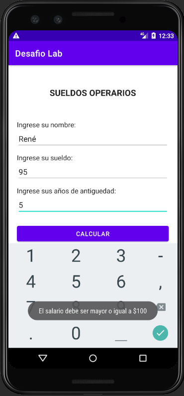

# App Android - Desafío DSM

De un operario se conoce su sueldo y los años de antigüedad. Se pide confeccionar un programa que lea los datos de entrada sueldo y años de antigüedad 

* Deben de ocupar dos actividades , una para solicitar datos y la otra para mostrar resultados , deben utilizar notificaciones toast.

* No debe de permitir ingresar valores negativos ni salario menor a 100

a) Si el sueldo es inferior a 500 y su antigüedad es igual o superior a 10 años, otorgarle un aumento del 20 %, mostrar el sueldo a pagar.

b) Si el sueldo es inferior a 500 pero su antigüedad es menor a 10 años, otorgarle un aumento de 5 %.

c) Si el sueldo es mayor o igual a 500 mostrar el sueldo en pantalla sin cambios.

## Integrantes

* **Jaime Eduardo Navarrete Cubías**
* **Gerardo Javier López Flamenco**
* **René Alexander Carrillo García**
* **Rolando Enrique Orellana Portillo**

## Pruebas de funcionamiento

### Pantalla inicial (Activity 1)

### Prueba de notificaciones Toast (Por no ingresar datos)

### Prueba de notificaciones Toast (Por ingresar un salario menor a $100)

### Prueba de funcionamiento 1

### Prueba de funcionamiento 2

### Prueba de funcionamiento 3

