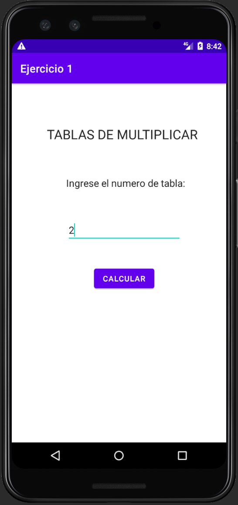
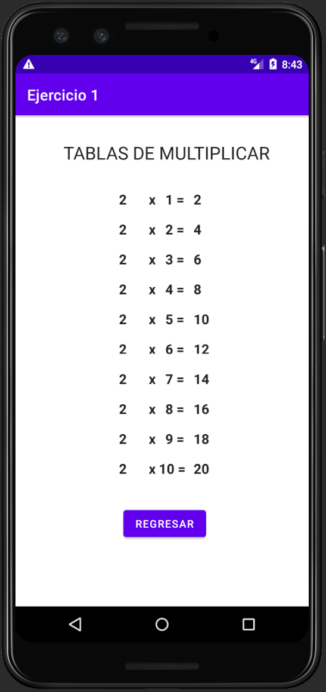
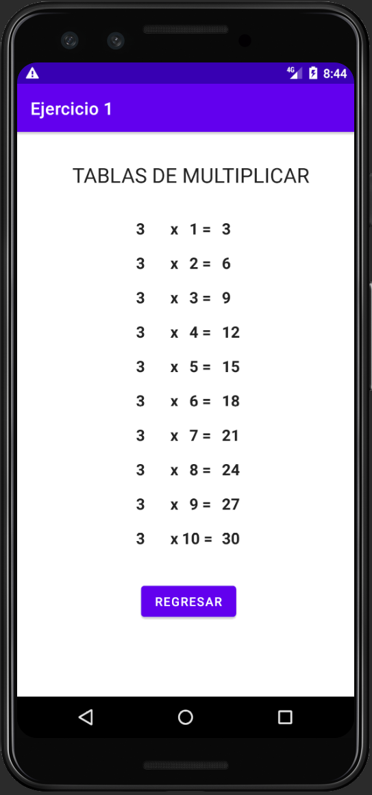

# Ejercicio 1 - DSM Lab G01L

## Problema

Se solicita una app que posea dos _activities_, de las cuales la primera debe solicitar el número de la tabla que quiera visualizar, mientras que en la segunda debe calcular todos los valores de la tabla y los debe mostrar en pantalla, y debe poseer un botón para regresar a la primera _activity_.

## Pruebas

### Muestra de pantalla de primera activity

### Prueba de segunda activity (tabla del 2)

### Prueba de segunda activity (tabla del 3)
